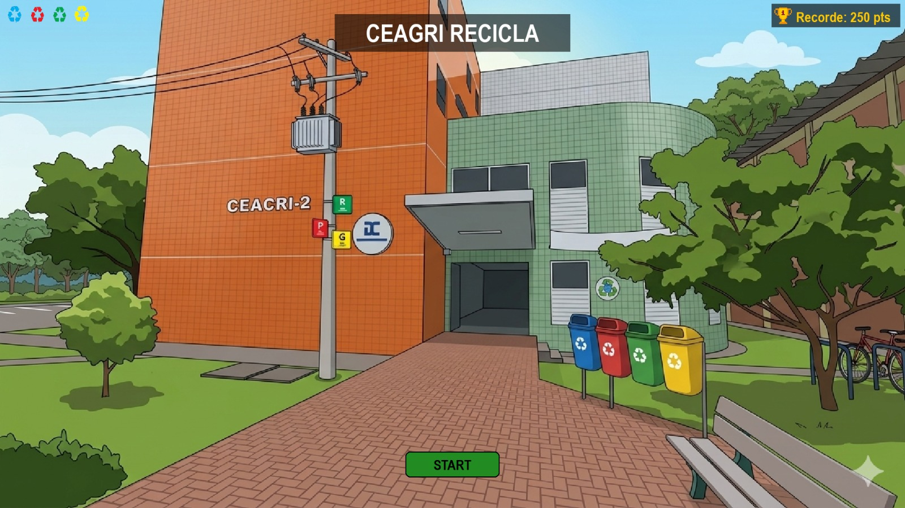
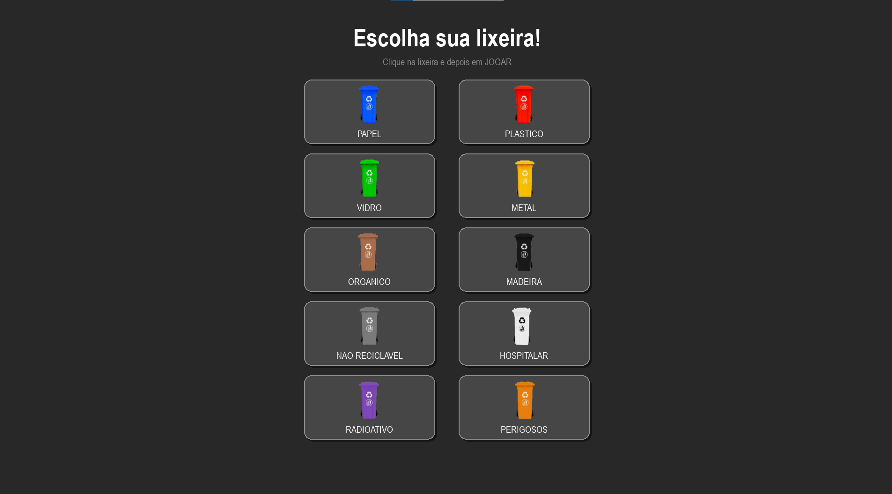

# CEAGRI Recicla

Jogo educativo de reciclagem desenvolvido para a disciplina de **[Princípios de Programação](https://classroom.google.com/u/6/c/Nzk2NDE4OTU2NzQx)** do curso de **Bacharelado em Sistemas de Informação (BSI)** da **UFRPE**.

---

## 🎮 Sobre o Jogo

**CEAGRI Recicla** é um jogo de coleta seletiva onde o jogador controla uma lixeira e deve capturar os itens corretos que caem do céu. O objetivo é separar corretamente os resíduos recicláveis, acumulando pontos e batendo recordes!

---

## 📸 Screenshots

### Tela Inicial


### Escolha da Lixeira


---

## 🕹️ Como Jogar

1. Clique em **START** na tela inicial
2. Escolha sua lixeira entre os **10 tipos disponíveis**
3. Use as **setas ← →** do teclado para mover a lixeira
4. Capture os itens do **tipo correto** para ganhar pontos
5. Capturar o tipo **errado** perde uma vida
6. O jogo termina quando todas as **4 vidas** se esgotarem
7. Pressione **P** para pausar e retomar o jogo
8. Pressione **R** para jogar novamente ou **ESC** para sair

---

## ⚙️ Funcionalidades

- **10 tipos de lixo**: Papel, Plástico, Vidro, Metal, Orgânico, Madeira, Não Reciclável, Hospitalar, Radioativo e Resíduos Perigosos
- **Imagens reais** dos objetos recicláveis
- **Velocidade progressiva**: a cada 50 pontos o jogo fica mais difícil
- **Sistema de níveis**: aviso na tela ao subir de nível
- **Sistema de combo**: acertos consecutivos aumentam o multiplicador de pontos (a cada 5 acertos seguidos o multiplicador sobe 0.5x)
- **Lixo Bônus**: item raro com brilho dourado que vale 30 pontos — sempre do tipo da sua lixeira
- **Pausa**: pressione **P** durante o jogo para pausar e retomar sem perder o progresso
- **Ranking Top 5**: as 5 melhores pontuações ficam salvas mesmo após fechar o jogo, com tela própria acessível no menu
- **Sistema de vidas**: 4 vidas representadas por ícones
- **Tela cheia** com tamanho proporcional a qualquer resolução

---

## 🛠️ Tecnologias e Conceitos Utilizados

### Linguagem
- **Python 3**

### Biblioteca Principal
- **Pygame 2** — biblioteca para desenvolvimento de jogos 2D em Python. É utilizada neste projeto pois o Python puro não possui recursos nativos para criação de jogos. Sem o Pygame não seria possível exibir janela, mover a lixeira, detectar colisões, tocar sons ou controlar o tempo.

  | Recurso | Módulo do Pygame utilizado |
  |---|---|
  | 🖼️ Exibir imagens e gráficos na tela | `pygame.display`, `pygame.draw`, `tela.blit()` |
  | ⌨️ Capturar teclas e cliques do mouse | `pygame.event`, `pygame.key.get_pressed()` |
  | 🎵 Reproduzir músicas e efeitos sonoros | `pygame.mixer.music`, `pygame.mixer.Sound` |
  | ⏱️ Controlar velocidade e FPS do jogo | `pygame.time.Clock` |
  | 🔲 Detectar colisão entre objetos | `pygame.Rect.colliderect()` |
  | 🖋️ Renderizar fontes e textos | `pygame.font.SysFont` |

### Bibliotecas Auxiliares
- **random** — sorteio aleatório dos tipos e itens de lixo
- **sys** — encerramento do programa
- **json** — salvamento e leitura do ranking em arquivo
- **os** — verificação de existência do arquivo de ranking
- **math** — cálculo do grid de lixeiras na tela de escolha

### Paradigma: Programação Orientada a Objetos (POO)
O projeto foi estruturado com **POO**, aplicando os seguintes conceitos:

| Conceito | Onde foi aplicado |
|---|---|
| **Classes** | `Jogo`, `Lixeira`, `Lixo`, `LixoBonus`, `Botao` — cada elemento do jogo é uma classe |
| **Herança** | `LixoBonus` herda de `Lixo`, reaproveitando `cair()` e `saiu_da_tela()` |
| **Polimorfismo** | `LixoBonus` sobrescreve `desenhar()` para adicionar o fundo dourado |
| **Encapsulamento** | Atributos e métodos organizados dentro de cada classe |
| **Abstração** | Cada classe representa um elemento real do jogo com responsabilidade única |
| **Instanciação** | Objetos criados dinamicamente (ex: novos lixos caindo a cada frame) |
| **Atributos de classe** | `TIPOS_DE_LIXO` em `Lixo` e `PONTOS_BONUS` em `LixoBonus` — compartilhados por todas as instâncias |
| **Métodos** | `desenhar()`, `mover()`, `cair()`, `foi_clicado()` etc. |

---

## 🗂️ Estrutura do Projeto

```
ceagri_recicla/
│
├── main.py                  # Ponto de entrada do jogo
│
├── models/
│   ├── jogo.py              # Controle geral das telas e lógica
│   ├── lixeira.py           # Lixeira controlada pelo jogador
│   ├── lixo.py              # Itens de lixo que caem na tela (Lixo e LixoBonus)
│   └── botao.py             # Botões clicáveis da interface
│
├── utils/
│   └── constantes.py        # Cores, tamanhos e fontes do jogo
│
├── assets/
│   ├── imagens/             # Imagens das lixeiras, lixos e ícones
│   └── sons/                # Arquivos de áudio do jogo (MP3)
│
├── recorde.json             # Arquivo gerado automaticamente com o ranking Top 5
└── README.md
```

---

## ▶️ Como Executar

### 1. Clone o repositório
```bash
git clone https://github.com/pollyanasousa/ceagri-recicla.git
cd ceagri-recicla
```

### 2. Instale as dependências
```bash
pip install pygame
```

### 3. Execute o jogo
```bash
python main.py
```

> ⚠️ **Nota:** Este jogo roda localmente e requer Python instalado na máquina. Por usar Pygame, **não é possível publicar no GitHub Pages** (que suporta apenas páginas web estáticas). Para jogar, é necessário clonar o repositório e executar localmente.

---

## 👩‍💻 Autora

**Pollyana Cassia de Sousa**  
Curso: Bacharelado em Sistemas de Informação — UFRPE  
Disciplina: [Princípios de Programação]  
Professor: **Cleyton Vanut Cordeiro de Magalhães**

---

## 📄 Licença

Projeto acadêmico sem fins comerciais.